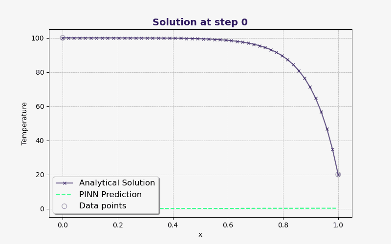

# Solving 1-Dimensional Convection-Diffusion Equation with Physics-Informed Neural Network (PINN)

This project simulates a 1D convection diffusion equation using [Physics-Informed Neural Networks (PINN)](https://www.sciencedirect.com/science/article/abs/pii/S0021999118307125). It was inspired by Prof Pavlos Aleiferis's assignment from Computational Fluid Dynamics Module and utilises the [DeepXDE](https://github.com/lululxvi/deepxde?tab=readme-ov-file) library for implementation.

Last updated: 2024-09-08

<p align="center">
  
</p>

<p align="center"><i>Figure 1: Schematic diagram of PINN, with loss driven by data, partial differential equations, and boundary conditions.</i></p>

DeepXDE is a popular library for PINN, and supports Tensorflow (1.x and 2.x), PyTorch, JAX, and PaddlePaddle as backends. It contains many in-built functions and tools which makes code structure simple. Additionally, it offers superior training time, as the automatic differentiation function is a [lazy evaluation](https://deepxde.readthedocs.io/en/latest/modules/deepxde.gradients.html#module-deepxde.gradients.gradients), which means that gradients are only computed when needed.

To install and use DeepXDE, make sure you have the required [prequisites](https://github.com/lululxvi/deepxde?tab=readme-ov-file).
```pip
$ pip install deepxde
```
DeepXDE can be then imported in Python:
```python
import deepxde as dde
```


## 1. Problem Setup
<p align="center">
  
</p>

<p align="center"><i>Figure 2: 1-D domain of length <i>L</i> transporting a property ϕ.</i></p>

A property $\phi$ is transported by means of convection and diffusion through the 1-D domain of length L. In a steady convection diffusion scenario, the equation can be define as:
```math
\frac{d}{dx}\left( ρ u \phi \right) = \frac{d}{dx}\left(\Gamma_\phi \frac{d \phi}{dx} \right)
```
<!-- $$\frac{d}{dx}\left( \rho u \phi \right) = \frac{d}{dx}\left(\Gamma_\phi \frac{d \phi}{dx} \right)$$ -->
where _u_ is the fluid velocity, _&rho;_ is the fluid density and $\Gamma_\phi$ is the diffusion coefficient. In real life terms, this problem could be the modelling of temperature distribution in an insulated pipe of length L carrying fluid from a hot reservoir at constant $T = T_0$ to a cold reservoir at constant $T = T_L$. 

The analytical solution is found using:
```math
\phi = \phi_0 + \frac{\text{exp}( ρ ux/\Gamma_\phi) - 1}{\text{exp}( ρ uL/\Gamma_\phi) - 1}\left( \phi_L - \phi_0 \right)
```
<!-- $$\phi = \phi_0 + \frac{\text{exp}( \rho ux/\Gamma_\phi) - 1}{\text{exp}( \rho uL/\Gamma_\phi) - 1}\left( \phi_L - \phi_0 \right)$$ -->
This assignment is typically solved using a finite-volume method, such as Central Differencing Scheme, or Power-Law Differencing Scheme. However, we will be using Physics informed Neural Network in this project to solve this.
## 2. Environment Variables

The variables are defined below. You can vary these variables to see a different simulation results.

```python
length = 1
T_hot = 100
T_cold = 20
diff_coeff = 1
density = 1
u = 10
```
Below, we will explore the implementation in PINN.

## 3. PINN Methodology and Results
Developed by [Raissi et al (2019)](https://www.sciencedirect.com/science/article/abs/pii/S0021999118307125), PINN is essentially a tradition [Deep Neural Network](https://datascientest.com/en/deep-neural-network-what-is-it-and-how-is-it-working) with an additional loss term that is defined by the physics loss in the form of differential equations. Its development leveraged the computationally-efficient automatic differentiation techniques, and does not use any numerical methods. Since then, there are a myriad of papers that seeks to employ PINN in their respective research field.

Two implementations are used in this project, namely:
- [Hard-constraint](https://arxiv.org/abs/2102.04626) data-free PINN model ,
- Soft-constraint PINN model with 2 data points.
The Hyper-parameters chosen in this project are the following:
```python
layer_size = [1] + [50] * 3 + [1]
acti = "tanh"
initializer = "Glorot uniform"
lr = 0.001
num_domain = 100
num_test = 100
train_distribution = "uniform"
optimiser = "adam"
```
### 3.1 Hard constraint PINN (hPINN)
The boundary conditions are enforced by hard-constraining the neural network output. The collocation points (an input point in the integration domain) have no labeled data,so the loss inside the domain is defined driven purely by physics loss. 

In DeepXDE, it is implemented using the following code:
```python
def output_transform(x, y):
    return T_hot + (T_cold - T_hot) * x / length + x * (x - length) * y

net.apply_output_transform(output_transform)

```
This model is trained with 25000 iterations, with the training process shown below.
<!-- <figure style="text-align: center;">
  
  <figcaption>Figure 1: hPINN training process.</figcaption>
</figure> -->
<p align="center">
  
</p>

<p align="center"><i>Figure 3: hPINN training process.</i></p>

### 3.2 Soft constraint PINN with two data points
Here, we add Dirichlet boundary conditions at $x=0$ and $x=L$ as a soft-constraint, which means that the boundary condtions are additional loss term inside the neural network. We can add more points, but I have found 2 to be sufficient for this problem.

This model is training with 5000 iterations, with the training process shown below.
<!-- <figure style="text-align: center;">
  
  <figcaption>Figure 1: PINN training process.</figcaption>
</figure> -->
<p align="center">
  
</p>

<p align="center"><i>Figure 4: PINN training process.</i></p>

## Citation
```
@article{lu2021deepxde,
  author  = {Lu, Lu and Meng, Xuhui and Mao, Zhiping and Karniadakis, George Em},
  title   = {{DeepXDE}: A deep learning library for solving differential equations},
  journal = {SIAM Review},
  volume  = {63},
  number  = {1},
  pages   = {208-228},
  year    = {2021},
  doi     = {10.1137/19M1274067}
}
@ARTICLE{Raissi2019-ay,
  title     = "Physics-informed neural networks: A deep learning framework for
               solving forward and inverse problems involving nonlinear partial
               differential equations",
  author    = "Raissi, M and Perdikaris, P and Karniadakis, G E",
  journal   = "J. Comput. Phys.",
  publisher = "Elsevier BV",
  volume    =  378,
  pages     = "686--707",
  month     =  feb,
  year      =  2019,
  language  = "en"
}

@ARTICLE{Lu2021-ik,
  title         = "Physics-informed neural networks with hard constraints for
                   inverse design",
  author        = "Lu, Lu and Pestourie, Raphael and Yao, Wenjie and Wang,
                   Zhicheng and Verdugo, Francesc and Johnson, Steven G",
  abstract      = "Inverse design arises in a variety of areas in engineering
                   such as acoustic, mechanics, thermal/electronic transport,
                   electromagnetism, and optics. Topology optimization is a
                   major form of inverse design, where we optimize a designed
                   geometry to achieve targeted properties and the geometry is
                   parameterized by a density function. This optimization is
                   challenging, because it has a very high dimensionality and
                   is usually constrained by partial differential equations
                   (PDEs) and additional inequalities. Here, we propose a new
                   deep learning method -- physics-informed neural networks
                   with hard constraints (hPINNs) -- for solving topology
                   optimization. hPINN leverages the recent development of
                   PINNs for solving PDEs, and thus does not rely on any
                   numerical PDE solver. However, all the constraints in PINNs
                   are soft constraints, and hence we impose hard constraints
                   by using the penalty method and the augmented Lagrangian
                   method. We demonstrate the effectiveness of hPINN for a
                   holography problem in optics and a fluid problem of Stokes
                   flow. We achieve the same objective as conventional
                   PDE-constrained optimization methods based on adjoint
                   methods and numerical PDE solvers, but find that the design
                   obtained from hPINN is often simpler and smoother for
                   problems whose solution is not unique. Moreover, the
                   implementation of inverse design with hPINN can be easier
                   than that of conventional methods.",
  month         =  feb,
  year          =  2021,
  copyright     = "http://creativecommons.org/licenses/by-nc-nd/4.0/",
  archivePrefix = "arXiv",
  primaryClass  = "physics.comp-ph",
  eprint        = "2102.04626"
}

```


## Acknowledgements

 - [Prof. Pavlos  Aleiferis](https://profiles.imperial.ac.uk/p.aleiferis)

